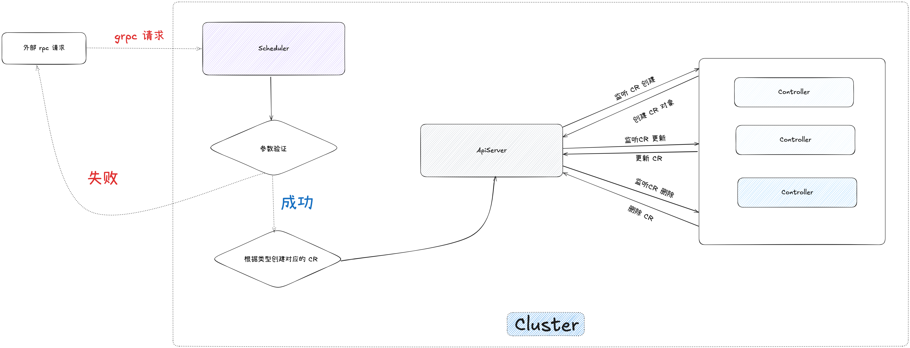

# StarInspect Scheduler 🚀

 

## 📖 项目简介

这是一个运行在 Kubernetes 集群内部的调度器组件，主要功能是接收和处理业务系统的任务调度请求。它作为任务调度的中间层，负责将业务任务转化为 Kubernetes 的自定义资源(Custom Resources)。

## ✨ 核心功能

- 🔄 提供任务调度 API 接口，接收业务系统的任务请求
- 🔄 将任务信息转换为 Kubernetes CR 资源
- 🔄 支持任务的创建、查询、更新和删除等操作
- 📊 提供任务状态监控和管理功能

## 🔧 技术架构

<table>
  <tr>
    <td>✅ 基于 Go-Zero 微服务框架开发</td>
    <td>✅ 使用 gRPC 作为通信协议</td>
  </tr>
  <tr>
    <td>✅ 与 Kubernetes API Server 交互</td>
    <td>✅ 采用 Controller 模式处理任务</td>
  </tr>
</table>

## 🔄 调度流程

## 🚀 快速开始

### 环境要求

- Kubernetes 1.16+
- Go 1.16+
- Docker

## 🤝 参与贡献

### 贡献指南

1. Fork 本仓库
2. 创建您的特性分支 (`git checkout -b feature/AmazingFeature`)
3. 提交您的更改 (`git commit -m 'Add some AmazingFeature'`)
4. 推送到分支 (`git push origin feature/AmazingFeature`)
5. 提交 Pull Request

欢迎任何形式的贡献，包括但不限于:

- 🐛 提交问题和建议
- 📝 改进文档
- ⚡️ 提供新功能或优化性能

### 开源协议

本项目采用 [MIT 许可证](LICENSE)。

您可以自由地:
- 使用、复制、修改、合并、出版发行、散布、再授权及贩售软件及软件的副本。
- 被授权人可根据程序的需要修改授权条款为适当的内容。

唯一的限制是，在软件和软件的所有副本中都必须包含版权声明和许可声明。

